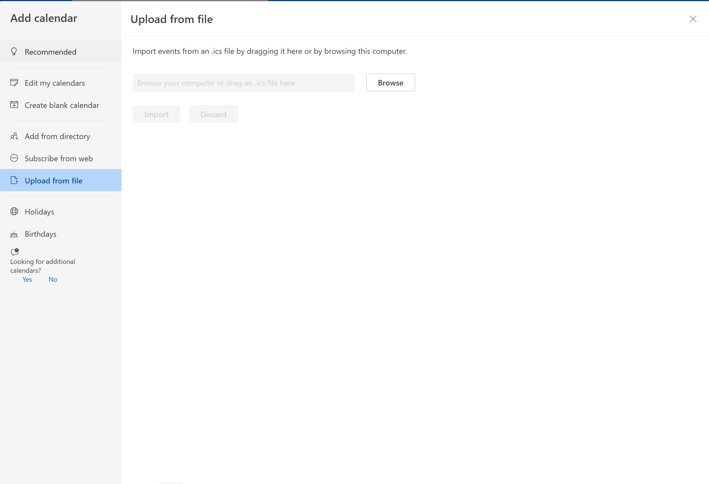
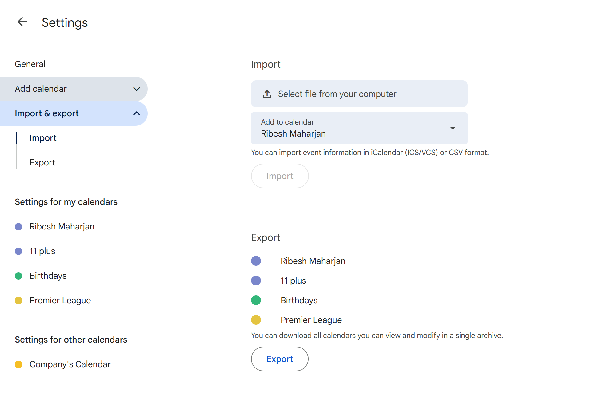
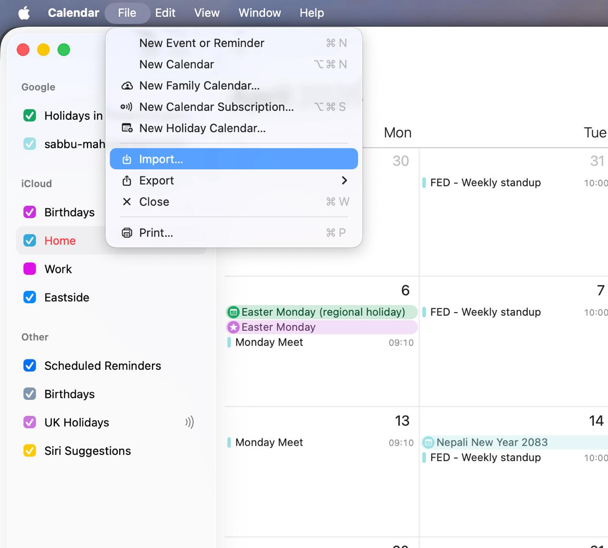

# Nepali Calendar for Outlook / Google Calendar / Apple Calendar

Subscribable .ics calendar files for Nepali public holidays, festivals, and cultural events — sourced from [nepalipatro.com.np](https://nepalipatro.com.np) and cross-referenced with [Wikipedia's Nepal public holidays list](https://en.wikipedia.org/wiki/Public_holidays_in_Nepal).

All event names are in **English**. Covers BS 2083 in full: **14 April 2026 – 13 April 2027**.

---

## Subscription URLs

Pick the file that suits you and follow the how-to for your calendar app below.

| Calendar | URL | Events |
|---|---|---|
| Public Holidays only | `https://Ribesh19.github.io/nepali-calendar/public-holidays.ics` | 40 |
| Public Holidays + Festival Holidays | `https://Ribesh19.github.io/nepali-calendar/festival-holidays.ics` | 47 |
| Everything (recommended) | `https://Ribesh19.github.io/nepali-calendar/all.ics` | 247 |

---

## How to Add the Calendar

There are two ways to add it:

- **Subscribe via URL** — the calendar stays in sync automatically (calendar app re-fetches once a day). Best for ongoing use.
- **Import a file** — a one-time snapshot. You download the .ics file and import it. No automatic updates.

---

### Outlook (New)

**Subscribe via URL (auto-updates):**
1. Open Calendar → click **Add Calendar** in the left sidebar
2. Select **Subscribe from web**
3. Paste the URL (e.g. `https://Ribesh19.github.io/nepali-calendar/all.ics`) → click **Import**

**Import a file (one-time):**
1. Download the .ics file from one of the URLs above (your browser will download it)
2. Open Calendar → **Add Calendar** → **Upload from file**
3. Browse to the downloaded file → click **Import**



> **If events only show for a few months:** Use Outlook Desktop (classic) instead of Outlook web/new — it handles subscribed calendar date ranges better. Or right-click the subscribed calendar → **Calendar Properties** and increase the future events range.

---

### Google Calendar

**Subscribe via URL (auto-updates):**
1. On the left sidebar, click **+** next to "Other calendars"
2. Select **From URL**
3. Paste the URL → click **Add calendar**

**Import a file (one-time):**
1. Download the .ics file from one of the URLs above
2. Open Google Calendar → click the **gear icon** (top right) → **Settings**
3. In the left panel, click **Import & export**
4. Under **Import**, click **Select file from your computer** → choose the downloaded .ics file
5. Choose which calendar to add events to → click **Import**



> **Note:** Google Calendar re-fetches subscribed calendars roughly every **24 hours**. You cannot force an immediate refresh. All events for the full year are in the file and will appear once synced.

---

### Apple Calendar (Mac)

**Subscribe via URL (auto-updates):**
1. Open Calendar → **File** → **New Calendar Subscription**
2. Paste the URL → click **Subscribe**
3. Set **Auto-refresh** to "Every day" → click **OK**

**Import a file (one-time):**
1. Download the .ics file from one of the URLs above
2. Open Calendar → **File** → **Import**
3. Select the downloaded .ics file → click **Import**
4. Choose which calendar to add the events to → click **OK**



---

### Apple Calendar (iPhone / iPad)

1. Open **Settings** → **Calendar** → **Accounts**
2. Tap **Add Account** → **Other**
3. Tap **Add Subscribed Calendar**
4. Paste the URL → tap **Next** → **Save**

---

## What's in each file?

### public-holidays.ics — 40 events
Official Nepali government public holidays (सार्वजनिक बिदाहरू) — days when government offices, banks, and schools are closed. Includes:
- Major festivals: Dashain (8 days), Tihar (5 days), Holi, Maha Shivaratri, Buddha Jayanti, Raksha Bandhan, Krishna Janmashtami, Teej, Chhath Parwa
- National days: Republic Day, Constitution Day, Democracy Day, Martyrs' Day, International Women's Day
- Community holidays: Lhosar (Tamang, Gurung, Gyalpo), Udhauli/Ubhauli (Kirat), Christmas, Guru Nanak Jayanti

### festival-holidays.ics — 47 events
Everything in public-holidays.ics **plus** major festivals not yet classified as official public holidays:
- Eid al-Adha (Bakr Eid)
- Indra Jatra (Swanchhya) — Kathmandu Valley chariot festival
- Additional community and cultural festivals

### all.ics — 247 events
Everything above **plus**:
- **Optional cultural events:** Mother's Day (Mata Tirtha Aunsi), Father's Day (Kushe Aunsi), Nag Panchami, Guru Purnima, Teej Eve feast, Dhanteras, and many more
- **Local jatras and fairs:** Bisket Jatra, Indrayani Jatra, Matsyendranath Rath Jatra, and others
- **Fasting days (vrats):** Ekadashi, Pradosh, and other observance days
- **International days observed in Nepal:** World Health Day, World Environment Day, World Human Rights Day, and 49 others

---

## Category Reference

| Category | What it means | Files |
|---|---|---|
| `public_holiday` | Official government public holidays | All three |
| `festival` | Festival Holidays (non-official) + notable exceptions | festival-holidays.ics, all.ics |
| `optional_holiday` | Cultural observances, local jatras, fasting days, civic days | all.ics only |
| `international_day` | International days observed in Nepal | all.ics only |

---

## Updating for a New BS Year (run in April each year)

Requirements: Python 3.11+, Playwright Chromium

```bash
# Install dependencies (first time only)
pip install -r requirements.txt
playwright install chromium

# 1. Scrape the new BS year
python -m scraper.scrape 2084

# 2. Copy and adapt the enrichment script for the new year, then run it
python scripts/enrich_2083.py   # adapt year references inside the script

# 3. Review data/2084.json — edit manually if anything looks wrong

# 4. Generate .ics files
python -m generator.generate 2084

# 5. Commit and push — GitHub Pages serves the updated files automatically
git add data/2084.json docs/
git commit -m "data: add BS 2084 events"
git push
```

---

## How It Works

1. **Scraper** (`scraper/scrape.py`) — Playwright renders nepalipatro.com.np calendar pages (a JavaScript SPA), BeautifulSoup extracts all events with both BS and AD dates
2. **Enrichment** (`scripts/enrich_2083.py`) — Adds English names and re-categorises events using Wikipedia's Nepal public holidays classification
3. **Generator** (`generator/generate.py`) — Reads `data/YYYY.json` and produces RFC 5545-compliant .ics files with a 24-hour refresh hint
4. **GitHub Pages** — Serves `.ics` files from `/docs` at `Ribesh19.github.io/nepali-calendar/`

## Data Source

[nepalipatro.com.np](https://nepalipatro.com.np) — scraped once per BS year around Baisakh 1 (mid April). Categorisation cross-referenced with [Wikipedia](https://en.wikipedia.org/wiki/Public_holidays_in_Nepal).
